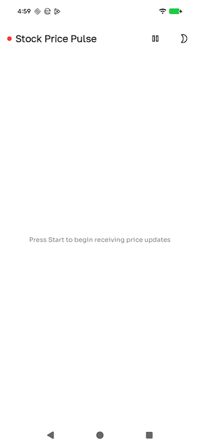
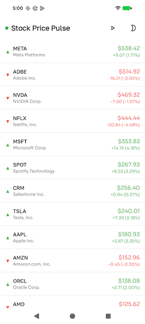
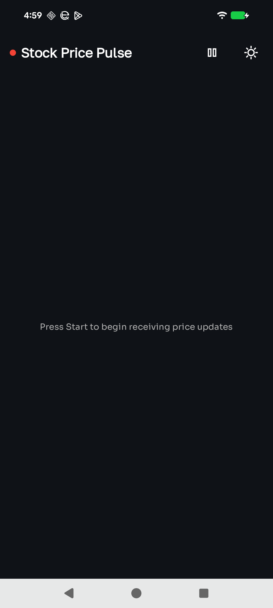
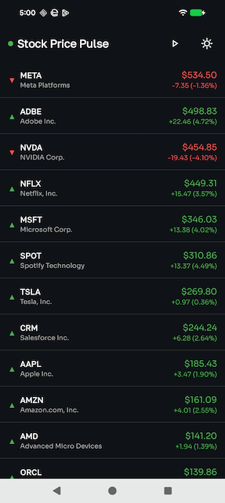

# 📈 StockPricePulse

A modern Android application for real-time stock price tracking with WebSocket connectivity. Built with Jetpack Compose following Clean Architecture principles, featuring Material Design 3 UI with comprehensive light and dark theme support.

## 📱 Screenshots & Demo

### Light Theme

<div align="center">
  
  
</div>

### Dark Theme

<div align="center">
  
  
</div>

### App Demo Video

📹 [Watch App Demo](screenshots/stockpulse.mov)

*Demonstrates real-time price updates, theme switching, and connection management.*

## ✨ Features

- **Real-time Price Updates**: Live stock price streaming via WebSocket connection with automatic reconnection handling
- **Price Movement Indicators**: Visual indicators with color-coded animations (green for up, red for down) and directional arrows
- **Automatic Sorting**: Stocks automatically sorted by price in descending order (highest first)
- **Connection Status**: Real-time connection status indicator with visual feedback (connected/disconnected/connecting/error)
- **Theme Support**: Comprehensive light and dark theme support with seamless switching and persistent preferences
- **Price Flash Animations**: Smooth color animations when prices change to highlight updates
- **Modern UI**: Clean, fintech-inspired design built with Material Design 3 components
- **Error Handling**: Comprehensive error handling with user-friendly messages and graceful degradation

## 🏗️ Architecture

The application follows **Clean Architecture** principles with clear separation of concerns across three distinct layers:

```
┌─────────────────────────────────────┐
│   Presentation Layer                │
│   (UI, ViewModels, MVI Pattern)    │
└──────────────┬──────────────────────┘
               │
┌──────────────▼──────────────────────┐
│   Domain Layer                     │
│   (Use Cases, Models, Interfaces)   │
└──────────────┬──────────────────────┘
               │
┌──────────────▼──────────────────────┐
│   Data Layer                       │
│   (Repository, Data Sources)       │
└─────────────────────────────────────┘
```

### Architecture Layers

**Presentation Layer**
- Implements MVI (Model-View-Intent) pattern for predictable state management
- Built entirely with Jetpack Compose for modern declarative UI
- ViewModel handles business logic and state management
- Reusable design system components and theme support

**Domain Layer**
- **Use Cases**: Encapsulate business logic
  - `SortStocksByPriceUseCase`: Sorts stocks by price in descending order
  - `CalculatePriceMovementUseCase`: Determines price movement direction and calculates changes
  - `ObservePriceUpdatesUseCase`: Observes real-time price update streams
  - `ManageWebSocketConnectionUseCase`: Manages WebSocket connection lifecycle
- Pure Kotlin domain models with no Android dependencies
- Repository interfaces define data operation contracts

**Data Layer**
- Repository implementation coordinates between data sources
- WebSocket data source for real-time communication
- Mock data source for testing and development
- Mappers transform data between DTO, Domain, and UI models

## 🛠️ Tech Stack

### Core Technologies
- **Kotlin**: 100% Kotlin codebase with modern language features
- **Jetpack Compose**: Declarative UI framework with Material Design 3
- **Coroutines & Flow**: Asynchronous programming and reactive streams
- **Ktor Client**: WebSocket and HTTP client for network communication
- **Kotlinx Serialization**: JSON serialization for data parsing

### Architecture & Dependency Injection
- **Koin**: Lightweight dependency injection framework
- **ViewModel**: Lifecycle-aware state management
- **StateFlow & Channel**: Reactive state management and side effects

### Testing
- **JUnit 4**: Unit testing framework
- **MockK**: Mocking library for Kotlin
- **Turbine**: Flow testing library for reactive streams
- **Coroutines Test**: Testing utilities for coroutines

## 🧪 Testing

The project maintains high test coverage with comprehensive unit tests across all layers:

**Test Coverage:**
- **Domain Layer**: 100% coverage (all use cases tested)
- **Data Layer**: 85% coverage (mappers and repository implementation)
- **Presentation Layer**: 80% coverage (ViewModel and state management)

**Test Structure:**
```
app/src/test/java/com/arslan/stockpricepulse/
├── domain/usecase/
│   ├── SortStocksByPriceUseCaseTest.kt
│   ├── CalculatePriceMovementUseCaseTest.kt
│   ├── ObservePriceUpdatesUseCaseTest.kt
│   └── ManageWebSocketConnectionUseCaseTest.kt
├── data/
│   ├── mapper/
│   │   ├── StockDtoToDomainMapperTest.kt
│   │   └── DomainToUiMapperTest.kt
│   └── repository/
│       └── StockPriceRepositoryImplTest.kt
└── presentation/screens/pricetracker/
    └── PriceTrackerViewModelTest.kt
```

**Running Tests:**
```bash
# Run all unit tests
./gradlew test

# Run tests with coverage report
./gradlew testDebugUnitTestCoverage

# Run specific test class
./gradlew test --tests "com.arslan.stockpricepulse.domain.usecase.*"
```

## 📂 Project Structure

```
app/src/main/java/com/arslan/stockpricepulse/
├── data/
│   ├── datasource/ (WebSocket, Mock)
│   ├── mapper/ (DTO↔Domain↔UI)
│   ├── model/ (DTOs)
│   └── repository/
├── designsystem/
│   ├── components/ (StockRow, TopBar, Indicators)
│   └── theme/ (Color, Typography, Spacing)
├── di/ (Koin modules)
├── domain/
│   ├── model/ (Stock, ConnectionStatus, PriceMovement)
│   ├── repository/ (Interfaces)
│   └── usecase/
└── presentation/
    └── screens/pricetracker/ (Screen, ViewModel, MVI)
```

## 🔧 Configuration

### WebSocket Configuration
The application uses a mock WebSocket data source by default. To connect to a production WebSocket server:

1. Update `WebSocketDataSourceImpl.kt` with your WebSocket server URL
2. Modify message parsing logic to match your server's message format
3. Update `StockPriceDto` data structure if your API format differs

### Theme Customization
Customize the app's visual appearance by modifying:
- `designsystem/theme/Color.kt`: Color palettes for light and dark themes
- `designsystem/theme/Type.kt`: Typography styles and font configurations
- `designsystem/theme/Spacing.kt`: Spacing constants and layout dimensions

## 📝 Key Implementation Details

### MVI Pattern
The app implements Model-View-Intent (MVI) architecture:
- **Intent**: User actions (StartPriceFeed, StopPriceFeed) trigger state changes
- **State**: Immutable UI state (stocks list, connection status, loading states)
- **Side Effects**: One-time events (error messages, success notifications) via Channel

### Real-time Updates
- WebSocket connection provides low-latency bidirectional communication
- Flow-based reactive streams handle price updates efficiently
- Automatic reconnection logic ensures continuous data flow
- State management prevents memory leaks with proper coroutine cancellation

### Price Movement Calculation
- Compares current price with previous price to determine direction
- Calculates absolute price change and percentage change
- Determines movement type: Up (green), Down (red), or Unchanged (gray)
- Updates UI with smooth animations to highlight price changes

## 👤 Author

**Mirza Arslan**  
GitHub: [@yourusername](https://github.com/yourusername)

---

Made with ❤️ using Kotlin and Jetpack Compose
